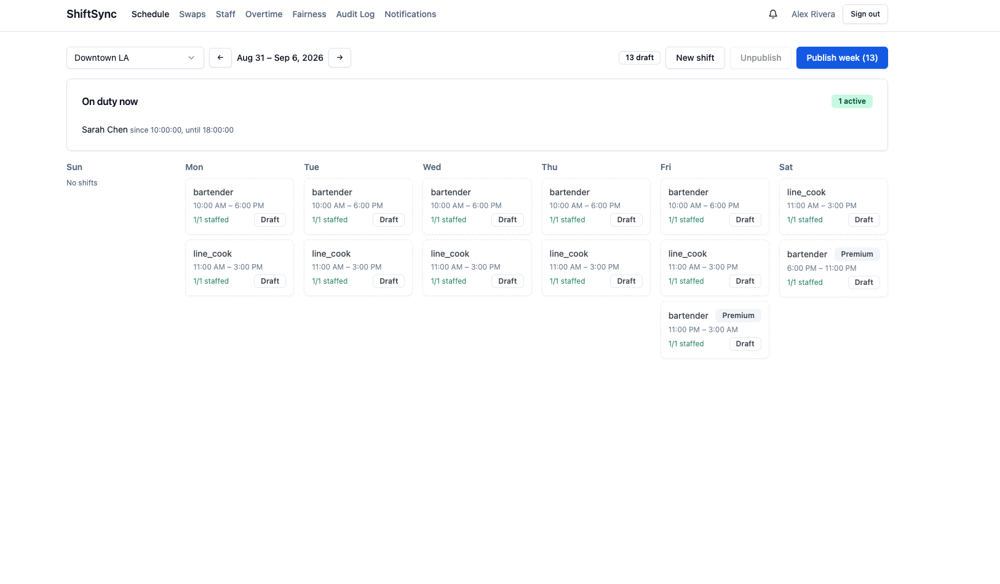

# ShiftSync

Multi-location staff scheduling platform for Coastal Eats, a 4-location restaurant group spanning two U.S. timezones.

## Live app

- App: https://shiftsync-client.onrender.com
- API: https://shiftsync-api-z3kx.onrender.com

## Stack

- **Backend:** Node.js, Express, TypeScript, MongoDB (Atlas, replica set) via Mongoose, Socket.io, JWT auth
- **Frontend:** React, Vite, TypeScript, TailwindCSS, shadcn/ui (Radix), React Query, Zustand
- **Shared:** a `@shiftsync/shared` workspace package holding enums, DTO types, and the constraint-engine result contract, imported by both server and client so the two never drift.

## Running locally

```bash
npm install
cp server/.env.example server/.env   # fill in MONGO_URI, JWT secrets
cp client/.env.example client/.env
npm run build --workspace=packages/shared
npm run seed --workspace=server
npm run dev:server
npm run dev:client
```

The client runs on `http://localhost:5173`, proxying `/api` and `/socket.io` to the server on `http://localhost:4000`. The API requires a MongoDB **replica set** (even a local single-node one) because assignment/swap writes use multi-document transactions — a standalone `mongod` will not work. MongoDB Atlas's free tier provisions a replica set by default.

## Deployment (Render)

A `render.yaml` blueprint at the repo root defines two services:

- `shiftsync-api` — Node web service, builds `packages/shared` then `server`, runs `node server/dist/index.js`.
- `shiftsync-client` — static site, builds `packages/shared` then `client`, publishes `client/dist`, with an SPA rewrite so client-side routing works on refresh.

To deploy: push this repo to GitHub, create a Render Blueprint from it, and set the `sync: false` environment variables in the Render dashboard (never commit them): `MONGO_URI` (an Atlas connection string, replica set required), `SEED_PASSWORD`, `CLIENT_ORIGIN` (the deployed client's URL, for CORS) on the API service, and `VITE_API_URL`/`VITE_SOCKET_URL` (the deployed API's URL) on the client service. `ACCESS_TOKEN_SECRET`/`REFRESH_TOKEN_SECRET` are auto-generated by Render. After the first deploy, run the seed script once against the production database (e.g. via Render's shell) to populate demo data.

## Demo accounts

Every seeded account uses the password **`Password123!`**.

**Admin**

| Email | Name | Notes |
| --- | --- | --- |
| admin@coastaleats.com | Alex Rivera | Full cross-location visibility |

**Managers**

| Email | Name | Manages |
| --- | --- | --- |
| manager.la@coastaleats.com | Jordan Kim | Downtown LA + Santa Monica |
| manager.nyc@coastaleats.com | Taylor Nguyen | Midtown NYC + Brooklyn Heights |
| manager.mixed@coastaleats.com | Sam Patel | Santa Monica (Pacific) + Midtown NYC (Eastern) — cross-timezone scope |

**Staff** (skills · desired weekly hours · certified location(s))

| Email | Name | Skills | Desired hrs | Certified at |
| --- | --- | --- | --- | --- |
| sarah.chen@coastaleats.com | Sarah Chen | bartender, server | 32 | Downtown LA |
| john.diaz@coastaleats.com | John Diaz | bartender | 30 | Downtown LA |
| maria.lopez@coastaleats.com | Maria Lopez | bartender, host | 25 | Downtown LA, Santa Monica |
| chris.evans@coastaleats.com | Chris Evans | line_cook | 38 | Downtown LA |
| priya.shah@coastaleats.com | Priya Shah | line_cook, dishwasher | 35 | Santa Monica |
| marcus.johnson@coastaleats.com | Marcus Johnson | server, host | 20 | Santa Monica |
| emily.white@coastaleats.com | Emily White | server | 28 | Santa Monica |
| david.kim@coastaleats.com | David Kim | barback, dishwasher | 25 | Downtown LA (re-certified), Santa Monica |
| olivia.brown@coastaleats.com | Olivia Brown | bartender, server | 30 | Midtown NYC |
| ethan.wright@coastaleats.com | Ethan Wright | line_cook | 40 | Midtown NYC |
| sophia.martinez@coastaleats.com | Sophia Martinez | server, host | 22 | Midtown NYC |
| liam.garcia@coastaleats.com | Liam Garcia | barback | 18 | Midtown NYC, Brooklyn Heights |
| ava.robinson@coastaleats.com | Ava Robinson | server | 26 | Brooklyn Heights |
| noah.clark@coastaleats.com | Noah Clark | line_cook, dishwasher | 32 | Brooklyn Heights |
| isabella.lewis@coastaleats.com | Isabella Lewis | bartender, host | 24 | Brooklyn Heights |
| grace.walker@coastaleats.com | Grace Walker | server, bartender | 20 | Santa Monica (Pacific) + Midtown NYC (Eastern) — cross-timezone availability |

All staff share the same recurring availability pattern: **Mon & Wed 9:00 AM–5:00 PM, Fri & Sat 4:00 PM–midnight**, all in their certified location's own local time.

Run `npm run seed --workspace=server` to (re)populate a fresh database and print the full credential list to stdout.

## Testing the evaluation scenarios

All scenarios below assume the app is freshly seeded (dates are relative to "this week" at seed time). Locations: **Downtown LA** and **Santa Monica** are Pacific time; **Midtown NYC** and **Brooklyn Heights** are Eastern time.

### 1. The Sunday Night Chaos (fast coverage path)
1. Log in as a staff member with an active shift (e.g. `david.kim@coastaleats.com` has a Santa Monica dishwasher shift with a pending drop request already seeded, expiring ~2h after seed time).
2. Log in as `priya.shah@coastaleats.com` (the only staff qualified for that shift — dishwasher skill + Santa Monica certification + matching availability) → **Swaps → Available drops** → **Claim**.
3. Log in as `manager.la@coastaleats.com` → **Swaps → Needs approval** → **Approve**. The shift is now reassigned to Priya, and both parties are notified in real time.

### 2. The Overtime Trap
1. Log in as `manager.la@coastaleats.com` → **Overtime dashboard**. Sarah Chen should already show ~44 hours this week (past the 40h threshold), flagged with a projected overtime cost.
2. Go to **Schedule → Downtown LA**, open any shift, and try assigning Sarah to it in the Assignment dialog — the **live "what-if" preview** shows her projected weekly hours and overtime cost impact *before* you confirm, without needing to actually assign her first.

### 3. The Timezone Tangle
1. Log in as `manager.mixed@coastaleats.com` (manages Santa Monica + Midtown NYC).
2. Try assigning **Grace Walker** to a shift at Santa Monica around 9am–5pm Pacific — passes cleanly.
3. Try assigning her to a shift at Midtown NYC around 9am–5pm Eastern — also passes cleanly, because her availability is matched against each shift's own location timezone independently, not translated from one zone to the other. (If the system used the opposite interpretation, the NYC shift would need to be ~12pm–8pm Eastern to match her Pacific "9am–5pm" — it doesn't need to be.)

### 4. The Simultaneous Assignment
1. Open the same **unstaffed** shift's Assignment dialog in two browser tabs, logged in as the same or two different managers of that location.
2. In both tabs, select a candidate and click **Confirm assignment** within a couple of seconds of each other.
3. One request succeeds; the other receives an immediate `409` conflict — either because the shift's optimistic-lock version changed underneath it, or because the candidate is now double-booked across locations — with a real-time toast notification, not a silent failure or duplicate assignment.

### 5. The Fairness Complaint
1. Log in as `manager.la@coastaleats.com` or the admin → **Fairness** page.
2. The premium (Friday/Saturday evening) shift distribution and equity score are already visibly uneven in the seed data — a manager can point to real, computed numbers (not opinions) to confirm or refute a "I never get Saturday nights" complaint.

### 6. The Regret Swap
1. Log in as `john.diaz@coastaleats.com` → **Swaps → My requests**. He has a pending swap offered to Maria Lopez (not yet accepted) — the **Withdraw** button is available here.
2. Log in as `maria.lopez@coastaleats.com` → **Swaps → Incoming** → **Accept**. The request moves to "awaiting manager."
3. Back as John → **Swaps → My requests** — the **Withdraw** button is now gone; only the manager (`manager.la@coastaleats.com` → **Swaps → Needs approval**) can still **Deny** it with a documented reason.

### Additional things worth clicking through
- **Publish/Unpublish**: Schedule page shows live "X published / Y draft" counts per week; buttons disable themselves when there's nothing to publish/unpublish.
- **Notifications**: the bell icon and full Notifications page both navigate to the relevant shift or swap when clicked; toasts are color-coded (green success, amber warning, red error).
- **Audit log** (admin only): filterable by location/date range, with CSV/JSON export — includes the seeded revoked-then-recertified staff record and the denied historical swap.
- **On-duty now** panel on the Schedule page shows whoever's shift window currently covers "now," if any.

## Seeded edge cases

The seed script deliberately plants these scenarios for evaluation:

- **Overnight shift**: Sarah Chen works Friday 11pm–Saturday 3am at Downtown LA, stored as a single shift document spanning midnight.
- **Overtime**: Sarah is also assigned five 8-hour weekday shifts the same week, putting her at 44 hours — past the 40h threshold — visible on the Overtime dashboard.
- **Pre-existing min-rest conflict**: Sarah's Friday day shift (ends 6pm) and her Friday overnight shift (starts 11pm) leave only 5 hours of rest, violating the 10-hour minimum. This is seeded directly (bypassing the constraint engine, which would normally block it) to model a real conflict a manager discovers after the fact — visible on that shift's history view — rather than a live assignment attempt.
- **Six consecutive days**: Chris Evans works six days in a row at Downtown LA, demonstrating the 6th-consecutive-day warning.
- **Pending swap**: John Diaz has requested to swap his Saturday evening bartending shift with Maria Lopez, awaiting her acceptance.
- **Drop request near expiry**: David Kim has an unclaimed drop request at Santa Monica expiring roughly 2 hours after the seed script runs.
- **Denied historical swap**: a past drop request from Maria Lopez was denied by a manager, with a documented reason, for audit-log demonstration.
- **Re-certification history**: David Kim's certification at Downtown LA was revoked (transfer to Santa Monica) and later re-granted, producing two certification rows rather than one mutated row.
- **Cross-timezone availability**: Grace Walker is certified at Santa Monica (Pacific) and Midtown NYC (Eastern), demonstrating that her stated "9am–5pm" availability is evaluated against each shift's own location timezone.

## Architecture overview

- **Constraint engine** (`server/src/constraintEngine`) is the single source of truth for scheduling rules — double-booking, minimum rest, skill/certification match, availability windows, daily/weekly hour thresholds, and consecutive-day limits. It is invoked identically from both the manual assignment endpoint and the swap-approval endpoint, so no code path can bypass a rule the other enforces.
- **Concurrency safety**: shift and assignment documents carry an optimistic-lock `version` field. Assigning staff runs inside a MongoDB transaction that re-checks the shift's version and conditionally increments it; a losing concurrent request gets an immediate `409` plus a targeted Socket.io event.
- **Timezone handling**: every instant is stored as UTC; each Location carries an IANA timezone string. All conversions run through one centralized `luxon`-based module (`server/src/time/tz.ts`) — nowhere else in the codebase does manual date/offset math.
- **Real-time**: Socket.io rooms scoped per-location and per-user, computed server-side from the authenticated user's role/scope (never client-requested), pushing schedule updates, swap resolutions, assignment conflicts, and notifications live. Publishing/unpublishing a week's schedule, editing or cancelling a shift, and any assignment change all emit their socket events and persist notifications to every affected staff member inside the same transaction as the underlying write.
- **Notifications**: all 7 required triggers are wired end-to-end — staff are notified on new shift assignment, shift changed/cancelled, swap/drop resolution, and schedule publish; managers/admins are notified on swap/drop requests needing approval, overtime warnings (fired the moment an assignment pushes a staff member's projected weekly hours past 40), and staff availability changes.
- **Authorization scoping**: managers can only create/revoke certifications or view/edit availability for staff certified at their own managed locations; staff can only view/edit their own availability or fetch their own full profile via `GET /users/:id` (coworker names on shift rosters come from the already-scoped `GET /users` list endpoint, not this one). Enforced by dedicated middleware (`scopeToOwnStaffOrManager`, `scopeToManagedLocation`), not left to the client.

## Documented decisions on ambiguous requirements

1. **De-certification history**: certifications are never deleted, only soft-revoked (`revokedAt`/`revokedReason`). Re-certifying the same staff member at the same location creates a new row rather than reviving the old one, preserving a full history of certification gaps for audit purposes.
2. **Desired hours vs. availability**: a staff member's desired weekly hours is a soft, analytics-only signal used in the under/over-scheduled fairness report. It never overrides or interacts with the hard availability-window, rest, or overtime rules — those remain the sole gatekeepers of whether an assignment is legal.
3. **Consecutive-day counting**: any active assignment whose shift overlaps a given calendar day (evaluated in that shift's own location timezone) counts that day as "worked" for consecutive-day tracking, regardless of shift length — a 1-hour shift and an 11-hour shift count identically. Overnight shifts count toward both calendar days they touch.
4. **Shift edited after swap approval**: once a swap or drop reaches `approved` status, the resulting assignment is final and independent of the original request. Any later edit to that shift is treated as an ordinary shift edit against the new assignee — it does not reopen or reference the completed swap.
5. **Location spanning a timezone boundary**: each Location is assigned exactly one IANA timezone at creation; no location is modeled as spanning two zones. A real-world site near a timezone boundary would be modeled under whichever single zone its physical address is legally in, and all shift/availability math for that location uses that zone exclusively.
6. **Availability across multi-timezone certifications**: a staff member's recurring availability ("9am–5pm") is interpreted **per-location, at match time** — "9am" always means 9am at wherever the shift physically takes place, not a fixed offset from the staff member's home timezone. This avoids the confusing alternative where a Pacific-time staffer's stated availability would silently shift to different local hours at an Eastern-time site.
7. **The Regret Swap**: a requester can freely withdraw their own swap/drop request while it is still waiting on the other staff member, but once the target has accepted (moving the request to "awaiting manager approval") the requester can no longer unilaterally withdraw it — the manager reviewing the request can still deny it with a documented reason. This prevents a requester from silently pulling the rug out from under a staff member who has already committed to covering the shift, while still leaving a clean way to stop the swap before it takes effect.

## Known limitations

- Access tokens are held in memory and are not immediately revoked on logout from an already-open socket connection for up to their 15-minute lifetime — acceptable for this assessment's scope, flagged here rather than silently left undocumented.
- The 24-hour drop-request auto-expiry is guaranteed correct via a lazy check on every read path (so it is never stale when actually viewed), backed by a best-effort in-process interval for proactive notification timing. Render's free/starter tiers do not guarantee a durable background worker, so exact-to-the-minute expiry notifications are not guaranteed — only correctness of state when read. The expiry sweep only ever targets unclaimed (`pending_claim`) drops — once a drop has been claimed and is awaiting manager approval, it is exempt from auto-expiry so a manager can never lose a claimed drop to the clock mid-review.
- Overtime cost projections use a flat hourly base rate with a 1.5x multiplier beyond 40 hours/week as a simplifying assumption; real payroll rules (location-specific rates, shift differentials) are out of scope.
- `react-router-dom` 6.x has an open npm-audit advisory (open-redirect via crafted `<Link>`/`useNavigate` targets). This app never renders a route target from untrusted user input, so the advisory does not apply to any code path here; noted rather than silently ignored.
- The production client bundle is a single ~575KB (185KB gzipped) JS chunk; route-based code-splitting was not implemented given the assessment's time constraints.
- Every backend module and its exact response shapes were verified through direct API integration testing (login, constraint evaluation, the full swap accept/approve lifecycle, concurrency conflicts, analytics) against a real MongoDB replica set, and the deployed app was manually clicked through end-to-end on the live Render URL (login, schedule creation and assignment, swap/drop request and approval flows, notifications) before submission.
- There is no admin UI screen for creating new users (managers/staff) or certifying staff at a location — those operations are fully implemented and enforced server-side (`POST /users`, `POST /users/:id/certifications`, both role-scoped) and are exercised by the seed script, but onboarding a new hire currently requires a direct API call rather than a form. The assessment's scope centers on scheduling, constraint enforcement, swaps, and real-time behavior rather than admin CRUD tooling, so this was deliberately left out of the UI to focus effort on the higher-weighted areas.


## Project UI



